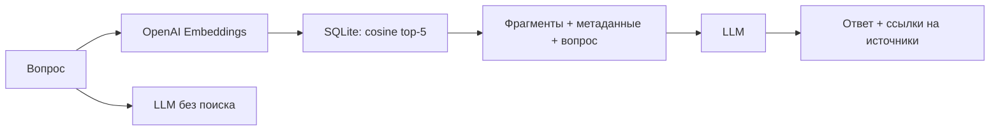
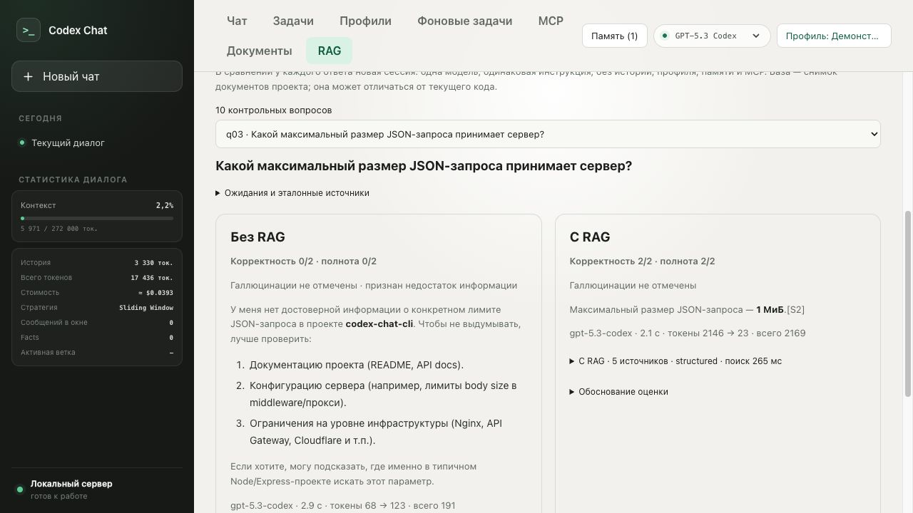

# Первый RAG-запрос — task 22

Агент поддерживает два режима: обычный ответ и ответ с поиском в локальном
SQLite-индексе из задания 21. В чате включите «Искать в документах (RAG)».
Под ответом сохраняются режим, найденные фрагменты, файл, заголовок, раздел,
chunk_id, cosine similarity, ссылки `[S1]` и расход токенов эмбеддинга.
Источники доступны и после перезагрузки страницы.

## Пайплайн



- Эмбеддинг вопроса строится той же моделью и размерностью, что индекс:
  `text-embedding-3-small`, 1536. Несовпадение отклоняется до сетевого запроса.
- Поиск точный cosine по чанкам `structured`, top-5. Эта стратегия выбрана по
  прошлому retrieval-прогону: Hit@5 0.70 против 0.55 для `fixed`.
- Максимум 9000 Unicode-символов текста источников; метаданные и инструкции
  добавляются отдельно. Отсечение выполняется до передачи модели, сохранённый
  trace содержит именно переданный текст.
- Инструкция задаётся отдельным developer-сообщением. JSON с фрагментами идёт
  как недоверенный пользовательский контекст, затем исходный вопрос.
  Текст документов не получает полномочий менять инструкции агента.
- Модель должна ссылаться на выданные ID и признавать недостаток доказательств.
  Сервер отмечает неизвестные ID; проверка существования ссылки не доказывает
  смысловую поддержку утверждения. Полная защита от prompt injection не обещается.
- Ошибки индекса/эмбеддингов возвращаются явно; скрытой замены на обычный ответ нет.
- В обычном чате сохраняются профиль, память, история и проверки инвариантов.
  «Без RAG» означает отсутствие нового поиска: прошлые ответы могут оставаться
  в истории. Скрытая цепочка `previous_response_id` с прежними источниками не
  используется при подключённом retriever. Для чистого сравнения есть вкладка RAG.

## Контрольные вопросы и сравнение

[Набор из 10 вопросов](documents/rag-questions.json) содержит ожидания и эталонные
источники с цитатами. Они зафиксированы до прогона. Отвечающая модель видит только
вопрос и, в режиме RAG, результаты поиска. Ни ожидания, ни эталоны ей не передаются.

[JSON](artifacts/rag/comparison.json) содержит реальные ответы, все фрагменты,
метрики, идентификатор корпуса и оценки. [Markdown](artifacts/rag/comparison.md)
удобен для чтения. Во вкладке «RAG» доступны все 10 пар, ожидания, основания оценок
и новое сравнение собственного вопроса. Каждый новый запуск делает два платных
LLM-запроса и один запрос эмбеддинга; сохранённый отчёт не изменяется.

У обоих режимов одна модель и одинаковая базовая инструкция. Каждый ответ — новая
сессия `agent.Agent`, без профиля, памяти, MCP и предыдущих сообщений. Температура
не задаётся, используется настройка модели по умолчанию. RAG дополнительно получает
инструкцию цитировать и опираться на найденные документы. Время RAG включает поиск.
LLM-токены и токены эмбеддинга учитываются отдельно.

Оценка каждого ответа:

- **Корректность 0–2:** 0 — нет верного ответа/ошибка; 1 — частично верно или
  вместе с неподтверждёнными деталями; 2 — верно и без существенных ошибок.
- **Полнота 0–2:** 0 — ожидания не раскрыты; 1 — раскрыта часть; 2 — раскрыты все.
- **Галлюцинация:** фактическое утверждение о проекте без опоры в базе; гипотеза,
  явно обозначенная как общая, сама по себе не считается галлюцинацией.
- **Воздержание:** модель явно признаёт недостаток информации; честный отказ
  получает 0 по содержанию, но не считается галлюцинацией.
- **Поддержка ссылками:** смысловая проверка цитат RAG; отдельно фиксируются
  неизвестные ID и наличие эталонной цитаты в top-5.

Оценки — экспертная проверка Codex с пояснениями, без независимого второго оценщика.
`reviews.json` привязан SHA-256 к каждому ответу: оценки нельзя незаметно применить
к новому тексту. Десять вопросов — учебный, малый набор, а не общая оценка модели.
Источник истины — замороженный `documents/corpus`, не текущая версия проекта.

## Воспроизведение

```sh
# Новый каталог обязателен, чтобы не затереть исходный прогон.
go run ./cmd/rag-eval -env-file .env -out artifacts/rag-new
# После проверки ответов применить оценки; сетевых запросов нет.
go run ./cmd/rag-eval -out artifacts/rag-new -reviews artifacts/rag-new/reviews.json

go test ./...
go vet ./...
docker compose up -d --build
```

CLI читает ключ только из окружения либо явно указанного `-env-file`, не выводит
его. Флаги `-index`, `-questions`, `-model`, `-out` позволяют повторить эксперимент.
При ошибке готовые пары сохраняются как неполный отчёт; повторный запуск используют
с новым `-out`. `-reviews` принимает объект `{question_id: {without: review, with:
review}}`; поля review см. в сохранённом `artifacts/rag/reviews.json`.

В Docker отчёт включён в образ, путь `RAG_REPORT_PATH=/documents/rag/comparison.json`.
Бинарник `/rag-eval` также включён в образ; для повторного прогона укажите
`-index /documents/artifacts/index.sqlite -questions /documents/rag-questions.json`
и доступный для записи `-out /data/rag-new`.

API: `POST /api/chat` принимает `rag: true|false`; `POST /api/rag/compare` принимает
`query` и необязательный `model`; `GET /api/rag/report` отдаёт сохранённый прогон.
API требует `X-Codex-Chat: 1`, same-origin и JSON для POST. Режим сравнения не
меняет чат, память, задачи или сохранённый отчёт.

## Результат сохранённого прогона

`gpt-5.3-codex`, 10 вопросов, 20 реальных ответов:

| Метрика | Без RAG | С RAG |
|---|---:|---:|
| Средняя корректность, 0–2 | 0.9 | 1.8 |
| Средняя полнота, 0–2 | 0.9 | 1.7 |
| Ответы с отмеченными галлюцинациями | 0/10 | 0/10 |
| LLM-токены всего | 2163 | 20627 |

Без RAG модель часто правильно описывает общий подход, но признаёт отсутствие
данных о проекте; частично верные общие объяснения получают частичный балл.
RAG дал содержательный ответ на 9 вопросов. На q02 поиск не вернул TTL 12 часов:
модель признала недостаток данных. На q11 ответ не назвал пользователя прямо как
подтверждающего переход, что снизило полноту. Эталонная цитата найдена в 8/10
выборок, но q04 успешно отвечен по альтернативному фрагменту README. Это показывает,
почему попадание точной цитаты и смысловое качество ответа оцениваются отдельно.

## Демонстрация

[Видео, 71 секунда, 1280×720](artifacts/rag/demo.mp4) показывает только область
веб-страницы: отчёт, ожидания и фрагмент источника, вопрос без найденного ответа,
новое сравнение через OpenAI и RAG в чате с восстановлением источников после
перезагрузки. Без звука; паузы между этапами записи сокращены.


